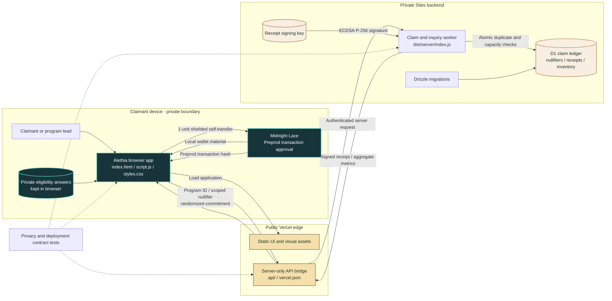

# Alethia

Alethia is a privacy-first aid allocation prototype. It lets a program verify that a claimant is eligible, has not already received the same benefit, and that supplies are still available--without publishing the claimant's identity or private answers.

**Live demo:** https://alethia-pi.vercel.app

The demo includes a 60-second interactive story, a test claim flow, signed receipt verification, duplicate prevention, live Proof Notes, a private program inquiry form, and an optional real Midnight Preprod transaction through Lace.

## Why Alethia exists

Aid teams need to distribute limited supplies fairly and prove where resources went. Traditional systems often solve this by collecting more personal data. Alethia explores a smaller-data approach: prove only the facts needed for allocation, keep eligibility evidence private, and publish aggregate accountability instead of personal profiles.

## How the demo works

1. The claimant answers eligibility questions locally in the browser.
2. The browser creates a randomized outcome commitment and a program-scoped nullifier.
3. The ledger accepts no more than one claim for the same nullifier and program.
4. A program inventory guard rejects claims after the configured supply capacity is reached.
5. Midnight users receive a 15-minute inventory reservation, approve a 1-unit shielded self-transfer in Lace, and attach the resulting Preprod transaction hash to the claim.
6. An accepted claim receives an ECDSA P-256 signed receipt that can be verified against the ledger.
7. Proof Notes updates from live aggregate claim, duplicate, and inventory data.

## Fair allocation model

Alethia does not need a public list of recipients to prevent repeat collection:

- **Eligibility:** in production, an approved issuer gives one private credential to each eligible allocation unit, such as a person or household.
- **Anonymous uniqueness:** that credential derives a different nullifier for each aid program. The ledger can detect a second claim for the same program, but cannot use the nullifier as a reusable public identity across programs.
- **Supply ceiling:** each program has a fixed inventory. A database trigger checks capacity and records allocation atomically, preventing concurrent requests from over-allocating stock.
- **Accountability:** signed receipts and aggregate totals let operators reconcile issued supplies without exposing recipient records publicly.

The demo enforces program-scoped uniqueness and a 1,000-unit test inventory. Incomplete Preprod reservations expire after 15 minutes and release their allocation. Eligibility is still self-attested: the network transaction is genuine Preprod evidence, but it is not yet a Compact eligibility proof.

## Feature status

| Capability | Status |
| --- | --- |
| Local private eligibility answers | Working |
| Program-scoped duplicate prevention | Working |
| Atomic test-inventory cap | Working |
| Signed, verifiable claim receipts | Working |
| Live aggregate Proof Notes | Working |
| Private program inquiry storage | Working |
| Midnight Preprod transaction submission | Working; requires funded Lace and user approval |
| Reservation expiry and inventory release | Working |
| Inquiry email notifications | Not configured |
| Issuer-backed eligibility credentials | Planned |
| Midnight Compact zero-knowledge proof | Planned |

## Privacy boundary

**Uploaded:** program ID, program-scoped nullifier, randomized outcome commitment, and demo wallet mode.

**Not uploaded:** eligibility answers, identity documents, wallet address, test-wallet secret, or a reusable wallet identifier.

The unique `(program_id, nullifier)` index enforces one claim per program. The `program_inventory` guard enforces the total allocation ceiling.

## Where feedback goes

The contact form stores inquiries in the private Sites database for the project owner. It returns a reference number to the sender. No public feedback feed or automatic email notification is configured yet.

## Implementation boundary

This is a signed privacy prototype, not a production aid-distribution system. It can submit a real Midnight Preprod self-transfer, but that transaction does not prove eligibility. The build does not yet issue trusted eligibility credentials or generate an on-chain Compact zero-knowledge proof. Do not use it for real beneficiary decisions without those controls, operational review, and a recovery or appeals process.

## Architecture map



## Run locally

Serve the repository with any static web server. The public claim APIs require the configured Vercel-to-Sites bridge.

Run the contract tests with:

```bash
npm test
```

## Demo checklist

1. Open the live demo and watch the 60-second story.
2. Select **Check eligibility**.
3. Use the test wallet, or connect a funded Preprod Lace wallet with tNIGHT and tDUST.
4. Complete the eligibility questions and submit a test claim.
5. For Lace, approve the separate 1-unit self-transfer and wait for its transaction hash.
6. Verify the signed receipt.
7. Retry with the same wallet to see duplicate prevention.
8. Confirm Proof Notes updates the accepted, duplicate, private-field, and remaining-supply totals.

## Roadmap

- Compact eligibility and nullifier contract (the current Preprod transaction is an anchor, not the eligibility proof)
- Issuer-backed credentials and selective disclosure
- Redemption confirmation and operator stock reconciliation
- Offline-safe synchronization and conflict handling
- Owner inquiry inbox/export and optional notifications
- Browser end-to-end, concurrency, and contract tests

## License

MIT - see [LICENSE](LICENSE).
