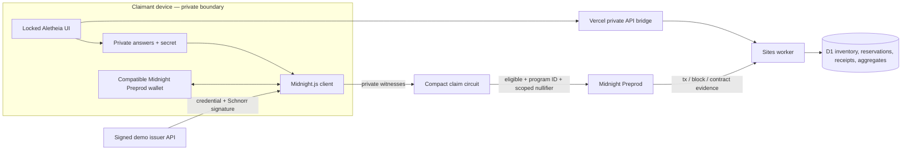

# Aletheia

**Prevent duplicate aid claims and over-allocation without building a public identity database.**

[Live demo](https://alethia-pi.vercel.app) · [Architecture](ARCHITECTURE.md) · [Wave 1 progress](WAVE1_PROGRESS.md) · [Privacy](PRIVACY.md) · [Security](SECURITY.md) · [60-second demo guide](DEMO.md)

## Submission snapshot

- **Build:** Aletheia
- **Website:** https://alethia-pi.vercel.app
- **Audience:** humanitarian field teams, program leaders, auditors, and privacy infrastructure judges
- **Feature to emphasize:** issuer-signed private eligibility plus program-scoped duplicate prevention and inventory caps
- **Viewer action:** try the claim lab, retry a program to see duplicate rejection, then send a private program-design inquiry
- **Preview format:** 60-second judge walkthrough in [DEMO.md](DEMO.md)

Aletheia proves that a claimant satisfies an aid policy, has not claimed that program before, and can still receive available inventory. Midnight Compact keeps age, income, household, jurisdiction, credential ID, and wallet secret private; the operational backend handles stock, reservations, reconciliation, aggregate Proof Notes, inquiries, and signed receipts.

Midnight supplies the private credential proof and public enforcement of a program-scoped nullifier: stable for the same claimant secret inside one program, different across programs. The deployed Compact contract does not enforce inventory caps; those belong to the backend. The open demo issuer can sign for new claimant commitments, so this prototype does not establish one unique human per secret or prevent a person from obtaining multiple demo credentials.

## Capability status

| Capability | Status | Evidence |
| --- | --- | --- |
| Compact eligibility, issuer, revocation, and nullifier circuit | **REAL SOURCE** | `contract/src/aletheia.compact` |
| Signed Jubjub/Schnorr demo credentials | **REAL, DEMO ISSUER** | `api/credentials.js`, `lib/issuer.js` |
| Browser proof generation and contract call | **REAL — TESTNET** | Confirmed Food Support claim in Preprod block `2391682`; [claim evidence](evidence/claim-preprod-food-support.json) |
| Midnight Preprod deployment | **REAL — TESTNET** | Operational contract `7e4e3c18a2a139711f17085aef0aa66c953fa901900ab66895c9a26cca257fa5`; [deployment evidence](evidence/deployment-preprod-operational.json) |
| Simulation claim path | **SIMULATED AND LABELED** | No blockchain/ZK claim is made |
| Three program inventory caps | **REAL OPERATIONAL BACKEND** | Atomic D1 triggers and reservations |
| Signed receipts and live aggregates | **REAL** | ECDSA P-256 receipts; private Sites database |
| Inquiry inbox/email notification | **PARTIAL** | Stored privately; no owner inbox or email alert yet |

The operational contract is `7e4e3c18a2a139711f17085aef0aa66c953fa901900ab66895c9a26cca257fa5`. The new constructor initializes the demo issuer and all three programs atomically, eliminating four follow-up setup transactions. A real Food Support claim was confirmed in Midnight Preprod block `2391682` with transaction hash `75d2978454c959f71f71b200177a865aec9a31ee316580ac5bb0df1abddad88a` and program-scoped nullifier `dcf6e13059fdecbfd66672da68a5d9eb1f7bd7cb38d3cfa890ed60bb40906a6b`. The public evidence is recorded in [evidence/claim-preprod-food-support.json](evidence/claim-preprod-food-support.json). The earlier contract and deployment record remain labeled historical because its browser-only admin key was lost.

The `/deploy.html` flow requires a passphrase-protected application-admin recovery file before any new deployment. Keep the encrypted file and passphrase separately; never commit a recovery file or enter a wallet seed. The current operational contract is already deployed, so judges and users should use the main application claim flow instead of deploying another copy. This recovery is for the application's admin circuits, not wallet access or SDK contract-maintenance keys.

The same page exposes **Submit live demo claim** after setup verification. It requests an eligible signed test credential, submits one Food Support call through the selected wallet, and preserves public transaction identifiers before broadcast. **Check live claim** independently checks a successful call at the saved contract and verifies its nullifier/program/eligibility in contract state. Pending submissions cannot trigger a second claim through this button. This standalone chain demo does not reserve or redeem backend inventory. Local claims require a working signed credential issuer; public-key-only configuration supports deployment but cannot issue credentials. Compiled circuit tests are not evidence of a live transaction.

Use **Check saved transaction** for a read-only Preprod lookup. Wallet acceptance is recorded separately from chain confirmation; submission failures retain a redacted error and never clear the pending marker. If an attempt is unconfirmed, an explicitly acknowledged fresh attempt can retain the same encrypted key and archive the old ID. An empty indexer response is not proof of non-submission: both attempts could later land and consume testnet DUST. The retry path checks again and resumes a confirmed deployment instead of knowingly duplicating it.

## Claim flow

1. Select Food Support, Medical Assistance, or Temporary Shelter.
2. Choose Midnight Compact or the clearly labeled simulation.
3. Keep eligibility answers and the claimant secret in the browser.
4. Obtain a signed demo credential bound to the private claimant commitment.
5. Reserve operational inventory before spending proving resources.
6. Generate the ZK proof and approve the Compact call in the selected Connector API v4 wallet.
7. Inspect chain evidence separately from backend reservation and receipt evidence. The captured standalone claim proves chain execution only.
8. Compiled tests demonstrate duplicate rejection for the same secret/program and different nullifiers across programs. Additional public rejection/cross-program captures remain pending.

## Repository map



## Run and validate

Full-path requirements: Node.js 22+, Compact toolchain `0.31.1`, Compact devtools `0.5.1`, proof server `8.1.0` or wallet-provided proving, Midnight.js `4.1.1`, a Connector API v4 wallet on Preprod, and funded tNIGHT/tDUST.

```bash
npm install
npm run compact
npm run build
npm test
npm run typecheck
```

Set `ALETHEIA_DEMO_ISSUER_SECRET` (32-byte server-side hex) and `ALETHEIA_CONTRACT_ADDRESS` (deployed Preprod address) in the hosted service. `VITE_ALETHEIA_CONTRACT_ADDRESS` remains an optional build-time fallback. `/api/health` exposes the validated hosted address as `contractAddress` with `midnightNetwork: preprod`; `midnightCompact` reports configuration, not a fresh chain/prover health check. Never use the demo issuer for beneficiary decisions. Production requires an accountable issuer, independent chain confirmation, appeals, redemption reconciliation, and managed keys.

For explicitly approved local use of the existing production demo issuer, set `ALETHEIA_DEMO_ISSUER_ORIGIN=https://alethia-pi.vercel.app` in the development-server environment. This forwards only a subject commitment and demo profile to that fixed issuer; no wallet seed, private key, cookies, or authorization headers are forwarded. On Windows, start Vite with `node --use-system-ca node_modules/vite/bin/vite.js --host 127.0.0.1 --port 3000 --strictPort` to use the Windows HTTPS trust store without disabling certificate verification. The relay is local-development-only and does not change the production service.

## Feedback ownership

The inquiry form writes to the project owner’s private Sites database and returns a reference number. It is not public. Automatic email notification and an owner inbox are pending.

## License

Apache License 2.0 — see [LICENSE](LICENSE).
