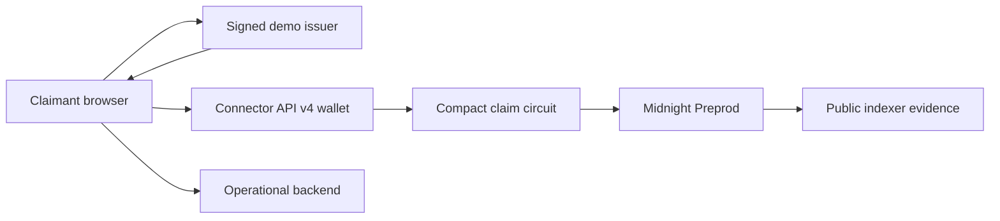

# Architecture

## Thesis

Aletheia keeps eligibility witnesses and claimant secrets in the browser, uses a signed demo credential as the private authorization input, and submits a Compact proof through a Connector API v4 wallet. Midnight stores only the successful program outcome and program-scoped nullifier; a separate operational backend manages inventory and signed receipts.

## Components

| Component | Responsibility | Trust |
|---|---|---|
| Browser UI | Collect test answers, hold private state, orchestrate proof | User-controlled |
| Demo issuer API | Sign test-only credentials | Trusted for demo eligibility |
| 1AM / compatible wallet | Approve, balance, prove, and submit | User-controlled |
| Compact contract | Verify signature/policy and reject used nullifiers | Network-enforced |
| Midnight Preprod/indexer | Execute and expose public evidence | Network-enforced/read-only |
| Vercel bridge + Sites backend | Inventory, reservations, inquiries, receipts | Operator-controlled |

## Flow

## Public vs Private

| Data | Location |
|---|---|
| Age, income, household, jurisdiction, credential, claimant secret | Browser/private proof state |
| Program ID, successful eligibility, scoped nullifier | Midnight public state |
| Transaction hash, contract address, block | Public evidence |
| Capacity, reservation, receipt metadata | Operational backend |

## Failure Paths

- Wallet/prover unavailable: no transaction is claimed; the UI reports failure.
- Submission uncertain: transaction identifier remains saved; the user must check before retrying.
- Indexer stale: status stays unconfirmed; no duplicate submission is automatic.
- Issuer unavailable: claim preparation stops before proof submission.
- Lost admin recovery: current contract remains usable for claims, but admin actions cannot be resumed from that key.

## Constraints

- Do not publish raw eligibility inputs or wallet secrets.
- Do not treat wallet acceptance as chain confirmation.
- Do not use a globally reusable nullifier.
- Do not silently replace real execution with simulation.
